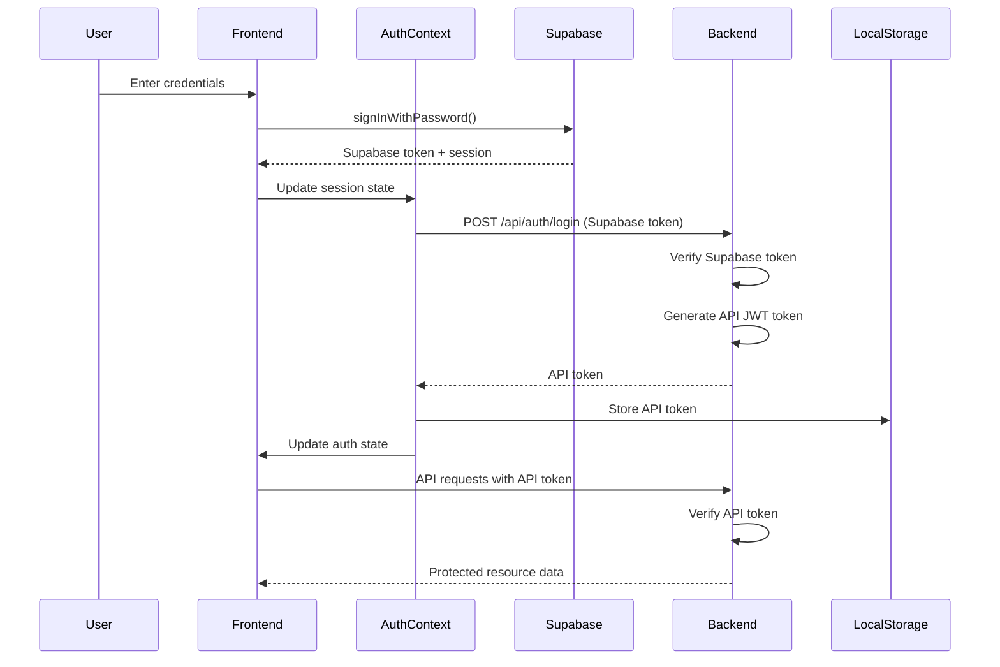
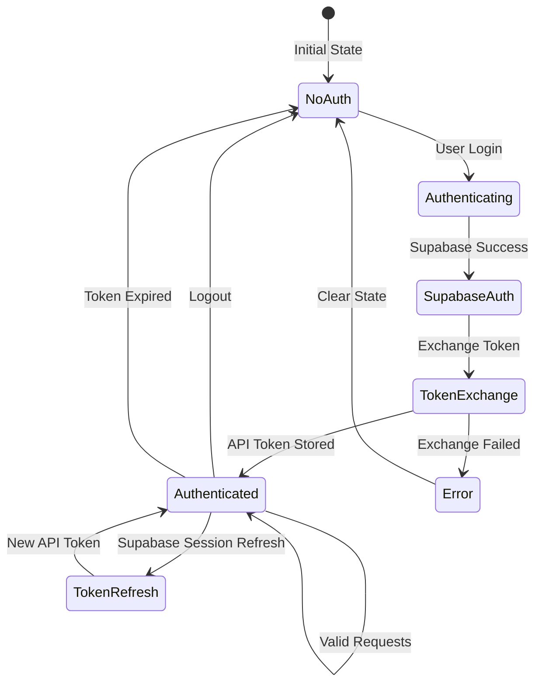

# Design Document

## Overview

This design addresses critical authentication token synchronization issues in the Digital Signage Platform. The solution ensures seamless token exchange between Supabase Auth and the backend API, implements robust error handling, and provides clear feedback for connection issues. The design focuses on maintaining authentication state consistency across the frontend and backend while handling edge cases like token expiration, server unavailability, and session refresh.

## Architecture

### Authentication Flow



### Token Lifecycle



## Components and Interfaces

### Frontend Components

#### Enhanced AuthContext

**Purpose**: Manage authentication state and token synchronization

**Key Methods**:
- `getInitialSession()`: Retrieve and validate existing Supabase session
- `authenticateWithAPI(supabaseToken)`: Exchange Supabase token for API token
- `ensureAPIToken()`: Verify API token exists before requests
- `handleTokenExpiration()`: Clear expired tokens and redirect to login
- `checkBackendHealth()`: Verify backend server availability

**State Management**:
```javascript
{
  user: User | null,
  session: Session | null,
  apiToken: string | null,
  loading: boolean,
  initialized: boolean,
  backendAvailable: boolean,
  authError: string | null
}
```

#### Enhanced ApiClient

**Purpose**: Handle API requests with proper authentication headers

**Key Methods**:
- `request(endpoint, options)`: Base request method with token injection
- `handleAuthError(error)`: Process 401/403 errors and trigger re-auth
- `retryWithAuth(endpoint, options)`: Retry failed requests after token refresh
- `checkHealth()`: Verify backend connectivity

**Token Injection Logic**:
```javascript
// Priority order for token selection
1. Check localStorage for 'api_token'
2. If missing, attempt to get Supabase token
3. If both missing, throw authentication error
4. Include token in Authorization header
```

### Backend Components

#### Enhanced Authentication Middleware

**Purpose**: Validate tokens and authenticate requests

**Token Verification Flow**:
```javascript
1. Extract token from Authorization header
2. Attempt JWT verification (API token)
3. If JWT fails, attempt Supabase token verification
4. If both fail, return 401 with specific error code
5. Attach user object to request
6. Call next() to proceed
```

**Error Codes**:
- `MISSING_TOKEN`: No Authorization header present
- `INVALID_TOKEN`: Token verification failed
- `EXPIRED_TOKEN`: Token has expired
- `AUTH_SERVICE_ERROR`: Internal authentication error

#### Backend Server Startup

**Purpose**: Ensure reliable server initialization

**Startup Sequence**:
```javascript
1. Load environment variables
2. Initialize Supabase client
3. Verify database connectivity
4. Register middleware
5. Register routes
6. Start listening on port
7. Log startup status and endpoints
8. Set up graceful shutdown handlers
```

## Data Models

### Token Storage Schema

**LocalStorage Keys**:
```javascript
{
  "api_token": "eyJhbGciOiJIUzI1NiIsInR5cCI6IkpXVCJ9...",
  "token_timestamp": "2024-02-06T10:30:00Z",
  "token_expiry": "2024-02-06T18:30:00Z"
}
```

### Authentication Error Response

```javascript
{
  "error": "Access token required",
  "code": "MISSING_TOKEN",
  "timestamp": "2024-02-06T10:30:00Z",
  "endpoint": "/api/dashboard/stats"
}
```

### Backend Health Response

```javascript
{
  "status": "OK",
  "timestamp": "2024-02-06T10:30:00Z",
  "service": "digital-signage-api",
  "version": "1.0.0",
  "environment": "development",
  "database": "connected",
  "supabase": "connected"
}
```

## Error Handling

### Frontend Error Handling

#### Authentication Errors (401)
```javascript
1. Log error details (endpoint, timestamp, error code)
2. Check if Supabase session is still valid
3. If valid, attempt token re-exchange
4. If invalid, clear all auth state
5. Redirect to login page
6. Display user-friendly error message
```

#### Connection Errors (ERR_CONNECTION_REFUSED)
```javascript
1. Detect connection failure
2. Display connection error banner
3. Provide "Start Backend" instructions
4. Disable API-dependent UI elements
5. Set up periodic health check polling
6. Re-enable features when connection restored
```

#### Token Expiration
```javascript
1. Detect expired token (401 with EXPIRED_TOKEN code)
2. Check Supabase session validity
3. If Supabase session valid, refresh and exchange
4. If Supabase session expired, redirect to login
5. Clear expired tokens from storage
```

### Backend Error Handling

#### Missing Token
```javascript
1. Check Authorization header presence
2. Return 401 with MISSING_TOKEN code
3. Include helpful error message
4. Log request details for debugging
```

#### Invalid Token
```javascript
1. Attempt JWT verification
2. Attempt Supabase token verification
3. If both fail, return 401 with INVALID_TOKEN code
4. Log verification failure details
5. Do not expose token details in response
```

#### Server Errors
```javascript
1. Catch authentication service errors
2. Log full error stack for debugging
3. Return 500 with AUTH_SERVICE_ERROR code
4. Provide generic error message to client
5. Do not expose internal implementation details
```

## Implementation Strategy

### Phase 1: Backend Server Reliability

**Tasks**:
1. Add comprehensive startup logging
2. Implement health check endpoint enhancements
3. Add database connectivity verification
4. Create startup script with error handling
5. Document server startup procedures

### Phase 2: Token Synchronization

**Tasks**:
1. Enhance AuthContext with token management
2. Implement token storage with timestamps
3. Add token validation before API requests
4. Create token refresh mechanism
5. Add logging for token lifecycle events

### Phase 3: Error Handling & Recovery

**Tasks**:
1. Implement 401 error interceptor in ApiClient
2. Add connection error detection and handling
3. Create user-friendly error messages
4. Implement retry logic with exponential backoff
5. Add error state management in UI

### Phase 4: Testing & Validation

**Tasks**:
1. Test complete authentication flow
2. Test token expiration scenarios
3. Test backend unavailability handling
4. Test token refresh mechanism
5. Validate error messages and logging

## Security Considerations

### Token Storage Security

**Approach**: Use localStorage with awareness of XSS risks

**Mitigations**:
- Sanitize all user inputs to prevent XSS
- Use Content Security Policy headers
- Implement token expiration
- Clear tokens on logout
- Consider httpOnly cookies for production

### Token Transmission Security

**Requirements**:
- Always use HTTPS in production
- Include tokens in Authorization header (not URL)
- Validate token format before transmission
- Log token usage without exposing token values

### Error Message Security

**Guidelines**:
- Never expose token values in error messages
- Avoid revealing authentication implementation details
- Use generic error messages for security failures
- Log detailed errors server-side only

## Performance Considerations

### Token Caching

**Strategy**:
- Cache API token in memory and localStorage
- Avoid redundant token exchange requests
- Implement token expiry checking before requests
- Minimize authentication overhead

### Request Optimization

**Approach**:
- Batch dashboard API requests where possible
- Implement request debouncing for polling
- Use exponential backoff for retries
- Cancel pending requests on logout

### Logging Performance

**Guidelines**:
- Use appropriate log levels (debug, info, error)
- Avoid excessive logging in production
- Implement log sampling for high-frequency events
- Use structured logging for easier parsing

## Monitoring and Debugging

### Authentication Metrics

**Track**:
- Login success/failure rates
- Token exchange success rates
- 401 error frequency by endpoint
- Token refresh frequency
- Average authentication latency

### Debug Logging

**Include**:
- Timestamp for all auth events
- User identifier (email or ID)
- Token type (Supabase vs API)
- Endpoint being accessed
- Error codes and messages
- Request/response correlation IDs

### Health Monitoring

**Monitor**:
- Backend server uptime
- Database connectivity
- Supabase service availability
- API response times
- Error rates by endpoint
