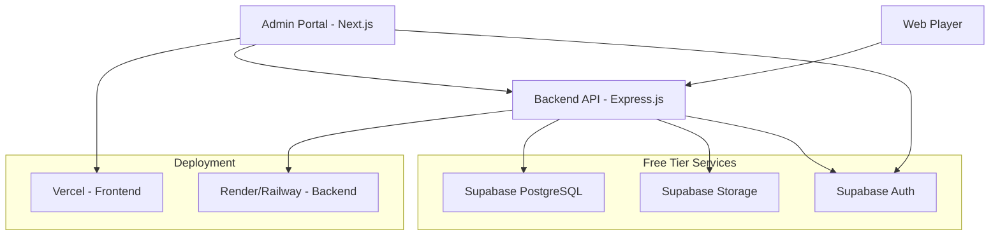

# Design Document

## Overview

The Digital Signage Platform is a full-stack JavaScript application that provides enterprise-grade digital signage management capabilities using only free-tier services. The system consists of three main components: an Admin Portal (Next.js), a Backend API (Express.js), and a Web Player application. The architecture leverages Supabase for authentication, database, and storage, ensuring scalability while maintaining zero operational costs.

## Architecture

### High-Level Architecture



### System Components

1. **Admin Portal**: Next.js application with App Router for administrative functions
2. **Backend API**: Express.js REST API with JWT authentication
3. **Web Player**: Standalone web application for content display
4. **Database**: Supabase PostgreSQL with Row Level Security
5. **Storage**: Supabase Storage for media files
6. **Authentication**: Supabase Auth with email/password

### Data Flow

1. Administrators authenticate through Supabase Auth
2. Admin Portal communicates with Backend API using JWT tokens
3. Web Players authenticate using device codes (no user login)
4. Real-time updates handled through polling (30-60 second intervals)
5. Media files served directly from Supabase Storage CDN

## Components and Interfaces

### Frontend Components (Next.js)

#### Authentication Layer
- **LoginPage**: Email/password authentication with Supabase
- **AuthProvider**: Context provider for authentication state
- **ProtectedRoute**: HOC for route protection

#### Core Pages
- **Dashboard**: System overview with statistics and recent activity
- **ScreensPage**: Screen management with online/offline status
- **MediaPage**: Media upload, preview, and management
- **PlaylistsPage**: Playlist creation with drag-and-drop interface
- **AssignPage**: Screen-playlist assignment interface

#### Shared Components
- **Sidebar**: Navigation component with enterprise styling
- **MediaUploader**: Drag-and-drop file upload component
- **PlaylistBuilder**: Sortable list component for playlist creation
- **StatusIndicator**: Real-time status display for screens
- **Modal**: Reusable modal component for forms and confirmations

### Backend API (Express.js)

#### Middleware
- **authMiddleware**: JWT token validation
- **corsMiddleware**: CORS configuration for frontend access
- **errorHandler**: Centralized error handling

#### Route Handlers
- **authRoutes**: Login, logout, profile management
- **screenRoutes**: CRUD operations for screens
- **mediaRoutes**: Media upload, retrieval, deletion
- **playlistRoutes**: Playlist management operations
- **playerRoutes**: Player API for content delivery
- **assignmentRoutes**: Screen-playlist assignment management

#### Services
- **supabaseService**: Database and storage operations
- **authService**: JWT token management
- **mediaService**: File upload and processing
- **heartbeatService**: Screen status monitoring

### Web Player Application

#### Core Components
- **PlayerApp**: Main application component
- **MediaRenderer**: Handles image/video display
- **PlaylistManager**: Manages content rotation
- **HeartbeatService**: Sends status updates
- **CacheManager**: Handles offline content storage

#### Player Features
- Fullscreen autoplay functionality
- Automatic content rotation with specified durations
- Offline caching using browser localStorage/indexedDB
- Graceful error handling for network issues
- Device pairing through unique device codes

## Data Models

### Database Schema

```sql
-- Users table (managed by Supabase Auth)
CREATE TABLE profiles (
  id UUID REFERENCES auth.users(id) PRIMARY KEY,
  email TEXT NOT NULL,
  created_at TIMESTAMP WITH TIME ZONE DEFAULT NOW(),
  updated_at TIMESTAMP WITH TIME ZONE DEFAULT NOW()
);

-- Screens table
CREATE TABLE screens (
  id UUID DEFAULT gen_random_uuid() PRIMARY KEY,
  name TEXT NOT NULL,
  device_code TEXT UNIQUE NOT NULL,
  location TEXT,
  status TEXT DEFAULT 'offline' CHECK (status IN ('online', 'offline')),
  last_heartbeat TIMESTAMP WITH TIME ZONE,
  created_at TIMESTAMP WITH TIME ZONE DEFAULT NOW(),
  updated_at TIMESTAMP WITH TIME ZONE DEFAULT NOW()
);

-- Media table
CREATE TABLE media (
  id UUID DEFAULT gen_random_uuid() PRIMARY KEY,
  name TEXT NOT NULL,
  type TEXT NOT NULL CHECK (type IN ('image', 'video')),
  file_path TEXT NOT NULL,
  file_size INTEGER,
  mime_type TEXT,
  duration INTEGER, -- for videos, in seconds
  created_by UUID REFERENCES profiles(id),
  created_at TIMESTAMP WITH TIME ZONE DEFAULT NOW(),
  updated_at TIMESTAMP WITH TIME ZONE DEFAULT NOW()
);

-- Playlists table
CREATE TABLE playlists (
  id UUID DEFAULT gen_random_uuid() PRIMARY KEY,
  name TEXT NOT NULL,
  description TEXT,
  created_by UUID REFERENCES profiles(id),
  created_at TIMESTAMP WITH TIME ZONE DEFAULT NOW(),
  updated_at TIMESTAMP WITH TIME ZONE DEFAULT NOW()
);

-- Playlist items table
CREATE TABLE playlist_items (
  id UUID DEFAULT gen_random_uuid() PRIMARY KEY,
  playlist_id UUID REFERENCES playlists(id) ON DELETE CASCADE,
  media_id UUID REFERENCES media(id) ON DELETE CASCADE,
  order_index INTEGER NOT NULL,
  duration INTEGER NOT NULL, -- display duration in seconds
  created_at TIMESTAMP WITH TIME ZONE DEFAULT NOW()
);

-- Screen assignments table
CREATE TABLE screen_assignments (
  id UUID DEFAULT gen_random_uuid() PRIMARY KEY,
  screen_id UUID REFERENCES screens(id) ON DELETE CASCADE,
  playlist_id UUID REFERENCES playlists(id) ON DELETE CASCADE,
  assigned_at TIMESTAMP WITH TIME ZONE DEFAULT NOW(),
  UNIQUE(screen_id) -- One playlist per screen
);
```

### API Response Models

#### Player API Response
```javascript
{
  "screen": "Lobby TV",
  "playlist": "Morning Ads",
  "items": [
    {
      "type": "image",
      "url": "https://cdn.supabase.co/storage/v1/object/public/media/banner1.jpg",
      "duration": 10
    },
    {
      "type": "video", 
      "url": "https://cdn.supabase.co/storage/v1/object/public/media/intro.mp4",
      "duration": 30
    }
  ]
}
```

#### Screen Status Model
```javascript
{
  "id": "uuid",
  "name": "Lobby TV",
  "device_code": "ABC123",
  "location": "Main Lobby",
  "status": "online",
  "last_heartbeat": "2024-01-15T10:30:00Z",
  "assigned_playlist": "Morning Ads"
}
```

## Error Handling

### Frontend Error Handling
- **Network Errors**: Retry mechanisms with exponential backoff
- **Authentication Errors**: Automatic redirect to login page
- **Validation Errors**: Form-level error display with specific messages
- **File Upload Errors**: Progress indicators with error recovery options

### Backend Error Handling
- **Authentication Failures**: Return 401 with clear error messages
- **Authorization Failures**: Return 403 with appropriate context
- **Validation Errors**: Return 400 with field-specific error details
- **Database Errors**: Log errors and return generic 500 responses
- **File Upload Errors**: Handle size limits and format restrictions

### Player Error Handling
- **Network Disconnection**: Continue with cached content
- **Media Load Failures**: Skip to next item with error logging
- **API Failures**: Retry with exponential backoff
- **Authentication Failures**: Display pairing instructions

## Testing Strategy

### Unit Testing
- **Frontend**: Jest and React Testing Library for component testing
- **Backend**: Jest for API endpoint and service testing
- **Player**: Jest for core functionality testing

### Integration Testing
- **API Integration**: Test complete request/response cycles
- **Database Integration**: Test CRUD operations with real database
- **Authentication Flow**: Test complete login/logout cycles
- **File Upload**: Test media upload and storage integration

### End-to-End Testing
- **Admin Workflow**: Complete admin user journey testing
- **Player Functionality**: Automated browser testing for player
- **Cross-Browser Compatibility**: Testing across major browsers

### Performance Testing
- **Load Testing**: API performance under concurrent requests
- **Media Delivery**: CDN performance and caching effectiveness
- **Player Performance**: Memory usage and rendering performance

## Security Considerations

### Authentication Security
- JWT tokens with appropriate expiration times
- Secure token storage using httpOnly cookies
- Password requirements and validation
- Session management and logout functionality

### Database Security
- Row Level Security (RLS) policies for all tables
- Parameterized queries to prevent SQL injection
- Input validation and sanitization
- Audit logging for sensitive operations

### File Upload Security
- File type validation and restrictions
- File size limits to prevent abuse
- Virus scanning (if available in free tier)
- Secure file naming to prevent conflicts

### API Security
- Rate limiting to prevent abuse
- CORS configuration for allowed origins
- Input validation for all endpoints
- Error message sanitization

## Deployment Architecture

### Frontend Deployment (Vercel)
- Automatic deployments from Git repository
- Environment variables for API endpoints
- Static asset optimization and CDN
- Custom domain support (optional)

### Backend Deployment (Render/Railway)
- Container-based deployment
- Environment variables for secrets
- Health check endpoints
- Automatic scaling within free tier limits

### Database and Storage (Supabase)
- Managed PostgreSQL with automatic backups
- CDN-enabled file storage
- Built-in authentication service
- Real-time capabilities (optional future enhancement)

## Performance Optimization

### Frontend Optimization
- Next.js App Router for optimal loading
- Image optimization with next/image
- Code splitting and lazy loading
- Caching strategies for API responses

### Backend Optimization
- Connection pooling for database
- Response caching for static data
- Compression middleware
- Efficient query optimization

### Media Delivery Optimization
- Supabase CDN for global content delivery
- Progressive image loading
- Video streaming optimization
- Browser caching headers

### Player Optimization
- Preloading of next media items
- Efficient memory management
- Background content updates
- Optimized rendering loops